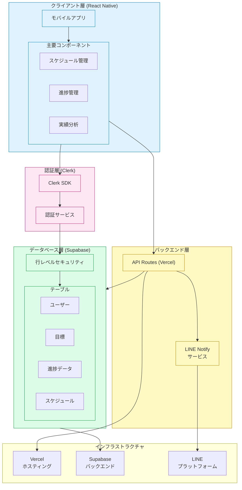
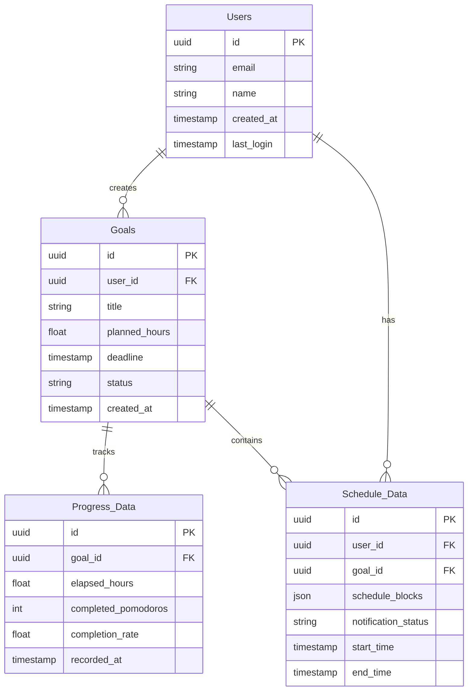

アーキテクチャ設計図をMermaidを使用して作成します。




主要な構成要素と特徴を説明します：

1. クライアント層
- React Nativeを使用したクロスプラットフォーム開発
- 主要機能コンポーネントの分離
- モバイルに最適化されたUI/UX

2. 認証層（Clerk）
- ソーシャルログイン対応
- セキュアなセッション管理
- JWTトークンベースの認証

3. バックエンド層
- Vercelのサーバーレス関数
- LINE Notify APIとの連携
- RESTful APIエンドポイント

4. データベース層（Supabase）
- リアルタイムデータ同期
- 行レベルセキュリティによるデータ保護
- 効率的なクエリパフォーマンス

テーブル設計の詳細も作成しましょう：



開発およびデプロイのフロー：

1. 開発環境のセットアップ
```bash
# プロジェクト作成
npx create-react-native-app schedule-app

# 必要なパッケージのインストール
npm install @clerk/clerk-react-native
npm install @supabase/supabase-js
npm install axios
```

2. 環境変数の設定（.env）
```env
NEXT_PUBLIC_CLERK_PUBLISHABLE_KEY=your_clerk_key
CLERK_SECRET_KEY=your_clerk_secret
SUPABASE_URL=your_supabase_url
SUPABASE_ANON_KEY=your_supabase_key
LINE_NOTIFY_TOKEN=your_line_token
```

3. セキュリティ考慮事項：
- Clerkによる認証情報の暗号化
- Supabaseの行レベルセキュリティ（RLS）の設定
- 環境変数の適切な管理
- APIエンドポイントの保護

この設計により以下の利点が得られます：
- スケーラブルなアーキテクチャ
- セキュアなデータ管理
- 効率的なリアルタイム同期
- 保守性の高いコード構造

追加したい機能や、特定の部分の詳細な設計が必要な場合は、お申し付けください。